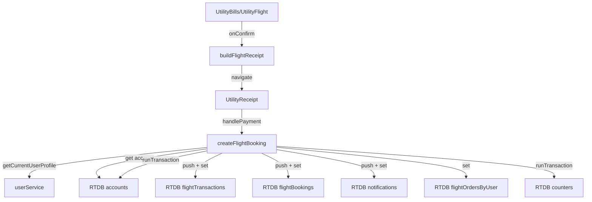

# Design Document: Flight Payment Integration

## Overview

This design document describes the implementation of payment functionality for the flight booking utility. The implementation follows a similar pattern to the existing movie and hotel booking services but uses **Realtime Database** for storing transactions and bookings instead of Firestore.

The core approach is to enhance the existing `createFlightOrder` function in `flightBookingService.ts` to include full payment processing, including user authentication validation, eKYC verification, account balance checking, atomic balance deduction, transaction recording in Realtime Database, and balance change notifications.

## Architecture

### High-Level Flow

```
User selects flight → Validates input → Checks authentication → Validates eKYC & permissions
→ Validates account → Checks balance → Deducts balance (atomic) → Creates RTDB transaction
→ Creates RTDB booking → Saves RTDB order → Sends notification → Returns result
```

### Component Interaction


